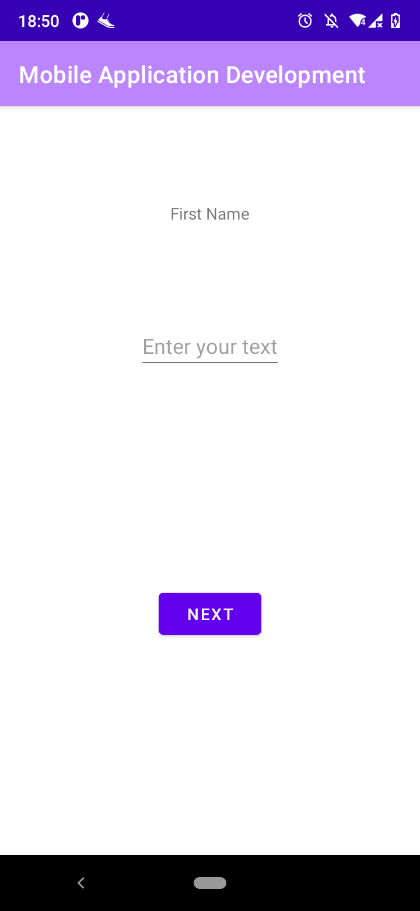
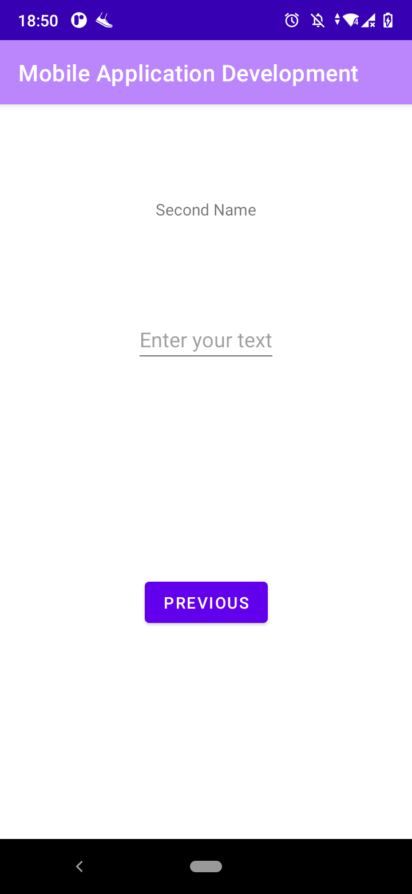
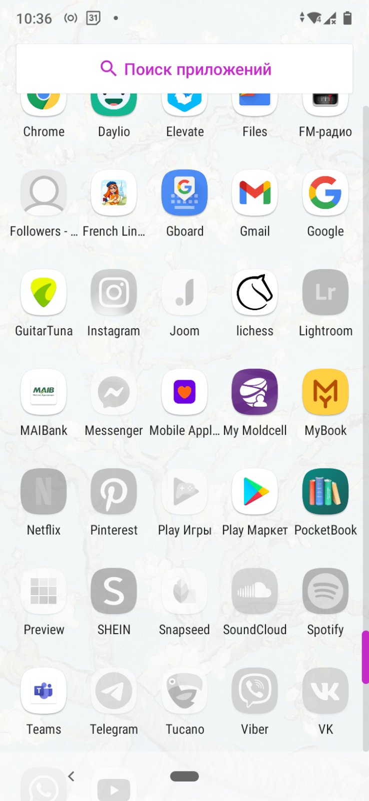

# Programming Mobile Applications Course. Spring 2021

## Laboratory work No. 1 - App basic setup

Laboratory work No.1 consist in performing basic setup of mobile application on selected platform.

### Laboratory work task:

1. Init mobile application on selected platform
2. Create at least 2 screens which transfer data from one screen to another
3. Perform some data changes to data you received in screen No. 2 and pass it back to screen No. 1
4. Add at least one active element on the screen, ex. button, text field and handle its action. Some not trivial action handling are welcome :)
5. Change Icon of the app to custom one

