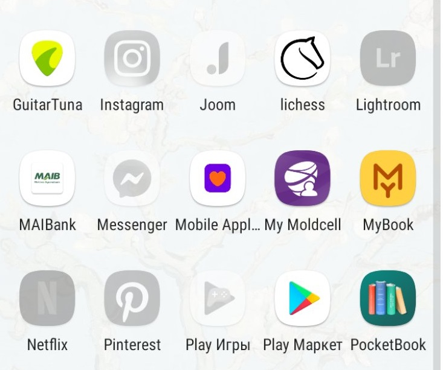

# Programming Mobile Applications Course. Spring 2021

## Laboratory work No. 1 - App basic setup

Laboratory work No.1 consist in performing basic setup of mobile application on selected platform.

### Laboratory work task:

1. Init mobile application on selected platform
2. Create at least 2 screens which transfer data from one screen to another
3. Perform some data changes to data you received in screen No. 2 and pass it back to screen No. 1
4. Add at least one active element on the screen, ex. button, text field and handle its action. Some not trivial action handling are welcome :)
5. Change Icon of the app to custom one

## Laboratory work No.2 - Basic layout and UI

### Laboratory work task:
1. Pick a theme for app.
2. Implement basic UI and layout of your app. Implement design for at least 3 functional screens, this means to create such screen as main home screen, feed or another screen which relates to app business logic.
3. At least 1 screen should present collection of data, in other words list of elements.
List should contain at least 30 elements. For this lab you could hardcode data which you will use in order to populate list, or it could be a dummy data, but it should be human readable.
On Android you should use "RecyclerView", on iOS you should use "UICollectionView"
4.Create your UI and layout to support portrait and landscape orientations and different screen sizes starting from phone with small screens (4 inch) to tablets with screen size 12 inch. 

It is how my List of To-Do things looks like
